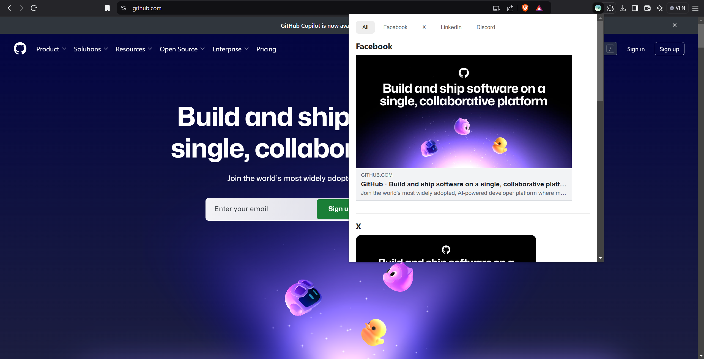

# Social Media Link Preview

Social Media Link Preview is a browser extension that shows a sample preview of how the webpage appears when it's link is shared on a social media platform such as Facebook and Twitter.

The extension fetches the open graph and twitter tags to replicate the behaviour.



## Download

Check releases, or [click here](https://chrome.google.com/webstore/detail/social-media-link-preview/dlmoajpiphhokgbbfaiiekhlgpjnjfei/) to download the latest version.

## Development

Clone the repository.
For development version run

```
yarn start
```

For production build.

```
yarn build
```

### Adding extension to chromium based browser

-   Open options and select extensions
-   Turn on Developer Mode
-   Choose "Load unpacked"
-   Navigate to the extension directory and select the "build" directory

## Contributing

Any kind of contributions are welcome. Makes sure to add a relevant emoji before your commit message, refer https://github.com/cooperka/emoji-commit-messages

---

Made with [Chrome Extension React Boilerplate](https://github.com/lxieyang/chrome-extension-boilerplate-react)
